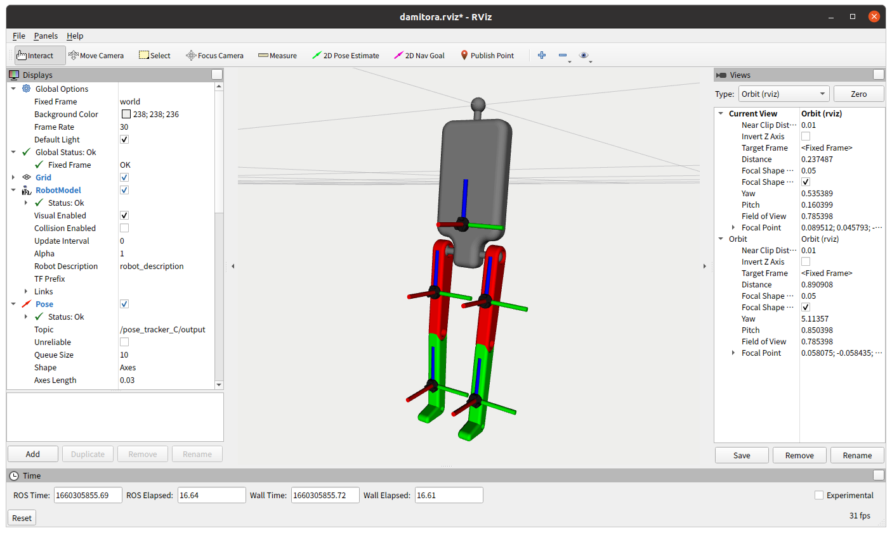

# ros_damitora について

## 概要

仮想トラッカー制御ソフト「だみとら」のROS版になります。

joint_stateを入力に持ち、関節角度から人形の位置姿勢を計算し、SteamVRにトラッカー座標を送ります。

Joint_state_publisher_guiを用いて、スライダで人形を制御したり、Dynamixelを用いた人形を作り、関節角度を直接物理的に入力することが出来ます。

全体像は下記の通り。


仮想トラッカーのSteamVRへの入力は、[@gpsnmeajp](https://github.com/gpsnmeajp)氏の [Virtual Motion Tracker](https://gpsnmeajp.github.io/VirtualMotionTrackerDocument/)を利用させていただいております。

ROS版だみとらと兄弟の、フリーソフトのだみとら２は下記、URLにて公開しております。

- だみとら2 (Boothにて無料公開中)  
  https://ddrive.booth.pm/items/3821909

また、開発環境は、Ubuntu 20.04LTS + ROS1 noetic の環境になります。

### 応用

joint_stateで関節角度をの入力を受け付けるため、IMUを用いた自作トラッカーや、全身にポテンショメータを貼り付けた自作トラッカー、その他、RealsenseやOpenPoseなど、いろいろ組み合わせて、ROSで自作トラッカーを製作する助けになる・・・かも・・・しれません。


### インストール

事前に以下のパッケージをインストールする。

```
$ sudo apt-get update
$ sudo apt install ros-noetic-joint-state-publisher-gui
$ sudo apt install ros-noetic-joint-trajectory-controller
$ sudo apt-get install ros-noetic-dynamixel-workbench-controllers
```

Windows側の設定は、SteamVRおよび、VMTのインストールが必要になります。
VMTのインストールに関しては、だみとら２をインストールおよび動作する状態にしていただければ、準備完了の状態になります。また、外部からOSCを受け付けるためにWindowsのファイアウォールの設定をお願いします。

### ビルド

1. ROSワークスペースのsrcフォルダの中にクローンして、catkin_make

```
$ cd ~/catkin_ws/src
$ git clone https://github.com/dreamdrive/ros_damitora.git
$ cd ..
$ catkin_make
```

## 使い方

### 使い方1 (joint_state_publisherで仮想トラッカーを制御する)

1. launchファイルの設定  
   「ros_damitora/damitora_osc/launch/rviz2osc.launch」のrosparamで、vmt_ipのところを、VMTおよびSteamVRを実行しているPCのIPアドレスに設定してください。
2. 下記コマンドを実行

```
$ roslaunch damitora_osc rviz2osc.launch 
```

Joint_state_publisher_guiのスライダを動かすと、SteamVRに認識されたトラッカーが動きます。


### 使い方2 (ソースコードから直接トラッカーを制御するサンプル)

1. launchファイルの設定  
   「ros_damitora/damitora_osc/launch/osc_test.launch」のrosparamで、vmt_ipのところを、VMTおよびSteamVRを実行しているPCのIPアドレスに設定してください。
2. 下記コマンドを実行

```
$ roslaunch damitora_osc osc_test.launch 
```

SteamVRに認識されたトラッカーが円を描いて動きます。
ros_damitora/damitora_osc/src/osc_test.cpp を編集していただいて、いろいろ動かすことが出来ます。


### 使い方3 (だみとら物理コントローラーの入力からトラッカーを制御)

※ こちらを動作させるには、だみとら物理コントローラー、もしくは同等のロボットが必要になります。

1. launchファイルの設定  
   「ros_damitora/damitora_osc/launch/dynamixel2osc.launch」のrosparamで、vmt_ipのところを、VMTおよびSteamVRを実行しているPCのIPアドレスに設定してください。usb_portの部分を実際に接続されたUSBポートに変更してください。
2. 下記コマンドを実行

```
$ roslaunch damitora_osc dynamixel2osc.launch
```

物理コントローラーを人形のように動かすと、姿勢通りのトラッカーの情報が送信されます。



### 使い方4 (だみとら物理コンのサーボを動作させつつ、その姿勢からトラッカーを制御)

※ こちらを動作させるには、だみとら物理コントローラー、もしくは同等のロボットが必要になります。

1. launchファイルの設定  
   「ros_damitora/damitora_osc/launch/dynamixel2osc_and_move.launch」のrosparamで、vmt_ipのところを、VMTおよびSteamVRを実行しているPCのIPアドレスに設定してください。usb_portの部分を実際に接続されたUSBポートに変更してください。
2. 下記コマンドを実行

```
$ roslaunch damitora_osc dynamixel2osc_and_move.launch
```

物理コントローラーが走り始めます。その結果の姿勢通りのトラッカーの情報が送信されます。走っている最中に足に負荷をかけると、負荷がかかって崩れた姿勢が、トラッカーにも反映されます。

### 使い方5 (その他、トラッカー情報を送らずにrvizで表示させるだけ)

足首も含めた、13関節で5つのトラッカーを制御するrvizの表示

```
$ roslaunch damitora_description display.launch
```

足首がない11関節で3つのトラッカーを制御するrvizの表示

```
$ roslaunch damitora_description display3.launch
```

足首がない11関節で5つのトラッカーを制御するrvizの表示

```
$ roslaunch damitora_description display5.launch
```

だみとら物理コントローラーの状態をrvizで表示するだけのサンプル

```
$ roslaunch damitora_description display3_dynamixel_sync.launch
```

### だみとら物理コンを使う時の、FTDIドライバのレイテンシタイマーの変更

```
 $ sudo chmod a+w /sys/bus/usb-serial/devices/ttyUSB0/latency_timer
 $ echo 1 > /sys/bus/usb-serial/devices/ttyUSB0/latency_timer
```

## 履歴
* 2022/08/13 :  とりあえず公開

## Author

* みっちー @ Dream Drive !!
  * [https://dream-drive.net/](https://dream-drive.net/)

## License

This is under [Apache License 2.0](./LICENSE).

